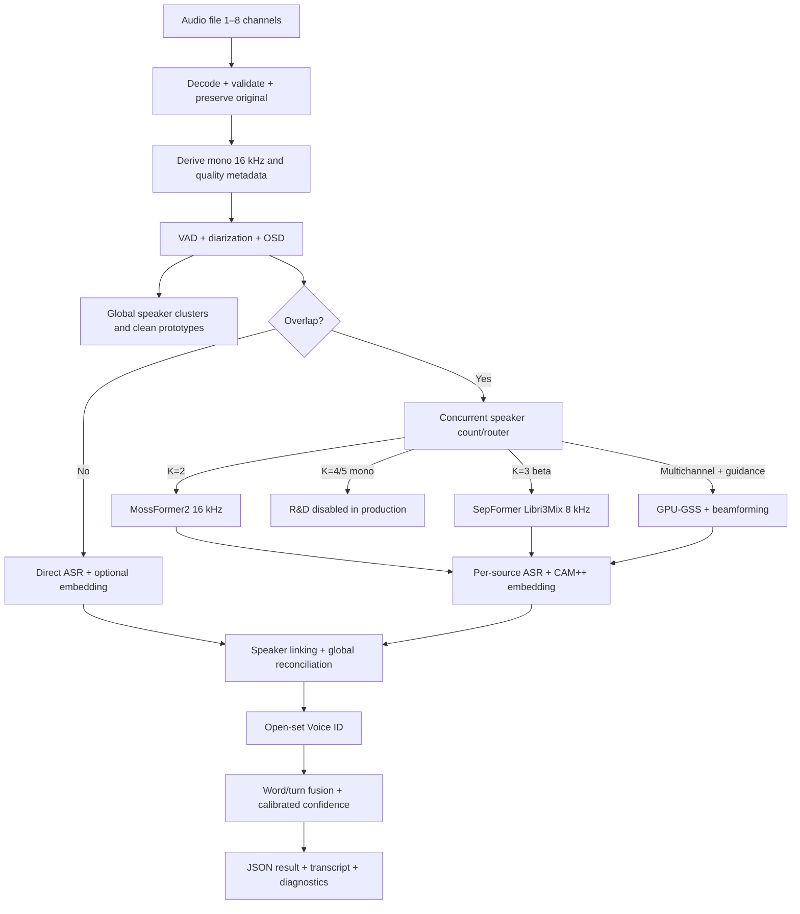
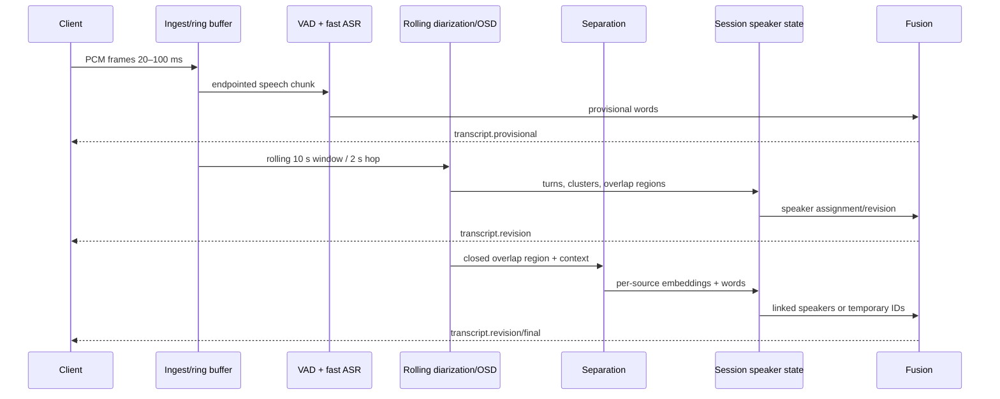
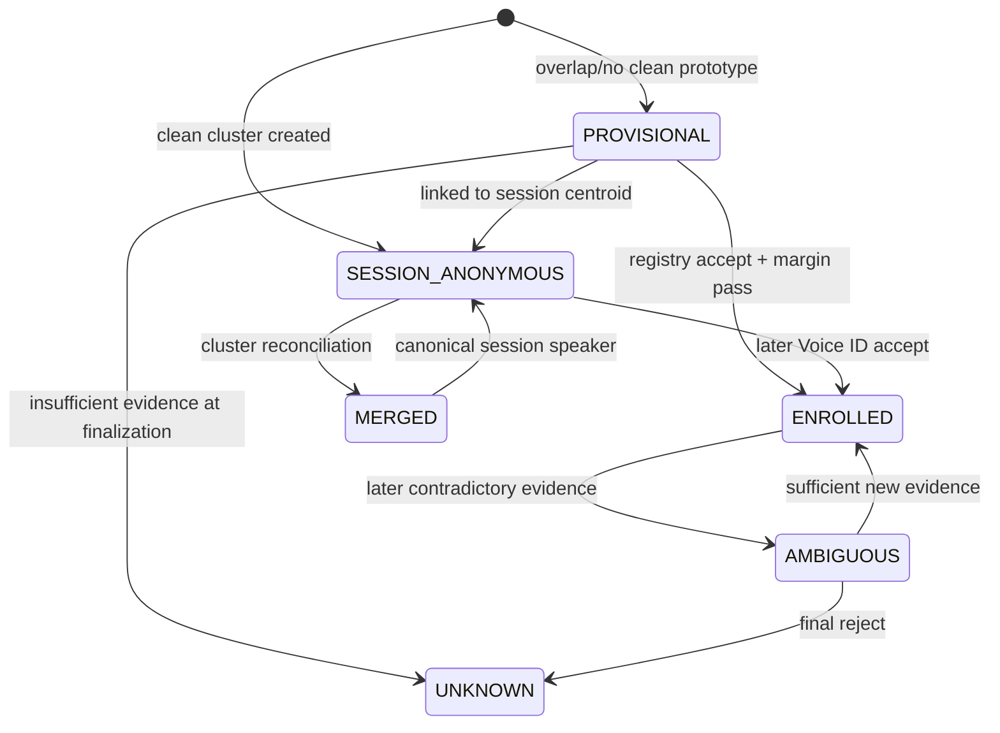
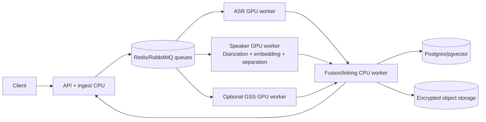

# Speaker-Attributed STT — Production Technical Specification

| Thuộc tính | Giá trị |
|---|---|
| Phiên bản | 1.0 |
| Ngày chốt | 13/08/2026 |
| Trạng thái | Implementation-ready baseline |
| Phạm vi | Audio file và near-realtime stream, 1–5 người trong phiên |
| Cam kết overlap V1 | Tối đa 2 người nói đồng thời |
| Chủ thể triển khai | Coding agent + kỹ sư ML/backend |
| Artifact hiện có | PoC integration/harness; chưa phải benchmark model thật |

Tài liệu này là nguồn yêu cầu chuẩn để coding agent triển khai sản phẩm. Các từ **MUST**, **MUST NOT**, **SHOULD** và **MAY** mang nghĩa bắt buộc, cấm, nên làm và tùy chọn.

## 0. Quyết định đã chốt

### 0.1 Ranh giới sản phẩm

1. Hệ thống MUST phân biệt được **1–5 người trong toàn bộ phiên** và duy trì nhãn ổn định `Speaker 1…Speaker 5`.
2. V1 MUST xử lý chính thức trường hợp **tối đa hai người nói đồng thời** trên audio mono.
3. Ba người nói đồng thời là tính năng `beta`, tắt mặc định và chỉ bật sau benchmark nội bộ.
4. Bốn hoặc năm người nói đồng thời trên **một kênh mono** là `research/best-effort`, MUST NOT được quảng bá hoặc kiểm thử như capability production.
5. Nếu bốn hoặc năm người nói đồng thời là yêu cầu bắt buộc, input SHOULD là microphone array đa kênh đồng bộ. Nhánh này dùng guided source separation/beamforming và được triển khai sau V1.
6. Nếu người tham gia đã đăng ký mẫu giọng, hệ thống trả `registry_speaker_id` và tên khi match open-set đủ tin cậy. Nếu không, hệ thống trả session speaker ID ổn định và nhãn `Speaker N` hoặc `Unknown`.
7. Hai transcript có timestamp chồng nhau MUST được giữ thành hai segment; hệ thống MUST NOT ép timeline thành độc quyền rồi làm mất người nói thứ hai.

### 0.2 Model baseline

| Nhiệm vụ | Model/backend mặc định | Vai trò | Trạng thái |
|---|---|---|---|
| Diarization toàn phiên | `pyannote/speaker-diarization-community-1` | global turns, speaker counting 1–5, regular/exclusive diarization | baseline production candidate |
| Diarization challenger | 3D-Speaker audio diarization | A/B test trên meeting tiếng Việt/châu Á | benchmark trước khi đổi default |
| Overlap detection | `pyannote/segmentation-3.0` hoặc output OSD tương đương trong 3D-Speaker | phát hiện vùng có hơn một giọng | baseline; không dùng để đếm 3–5 nguồn |
| Speaker embedding | 3D-Speaker `CAM++` 16 kHz | clustering, source linking, Voice ID | default |
| Embedding chất lượng cao | 3D-Speaker `ERes2NetV2` 16 kHz | final/offline challenger | bật nếu benchmark chứng minh lợi ích |
| Embedding runtime khác | WeSpeaker | ONNX/C++ deployment challenger | optional |
| Tách hai nguồn | ClearerVoice `MossFormer2_SS_16K` | mono 2-speaker separation | production candidate |
| Tách ba nguồn | SpeechBrain `sepformer-libri3mix` | mono 3-speaker separation | beta, 8 kHz |
| Tách 4–5 nguồn mono | Multi-Decoder DPRNN | source count + separation 2–5 | R&D only, production disabled |
| Tách 4–5 nguồn đa kênh | GPU-GSS + WPE/CACGMM/beamforming | diarization-guided spatial separation | phase 2 |
| Target-speaker extraction | WeSep | tách từng người khi có enrollment/roster | experimental |
| ASR near-realtime | faster-whisper `large-v3-turbo` | transcript nhanh, word timestamps | default |
| ASR final/offline | faster-whisper `large-v3` | optional final rescore | quality mode |

`Multi-Decoder DPRNN` công khai dùng WSJ0 8 kHz và model card nêu dữ liệu gốc theo điều kiện research-only. Adapter MAY tồn tại để nghiên cứu nhưng image production, manifest thương mại và feature flags MUST vô hiệu hóa checkpoint này.

### 0.3 Quyết định kiến trúc phần mềm

- V1 là **modular monolith với worker processes**, không tách thành quá nhiều microservice ngay từ đầu.
- Mọi model MUST nằm sau interface/port để có thể đổi model bằng cấu hình.
- API, schema và domain logic không được import trực tiếp framework của model.
- Model weights MUST được pin bằng revision + SHA-256, pre-stage vào `/models`; worker MUST NOT tự tải model khi khởi động production.
- Confidence chưa calibration MUST là `null` kèm `confidence_status="uncalibrated"`; MUST NOT sinh các số trông giống xác suất như PoC harness.
- Timestamps nội bộ dùng sample index hoặc integer milliseconds; MUST NOT cộng dồn số thực để tránh drift.

## 1. Phạm vi và mức hỗ trợ

### 1.1 Input

Hệ thống nhận:

- file: WAV, FLAC, MP3, M4A/AAC và Ogg/Opus;
- stream V1: PCM signed 16-bit little-endian qua WebSocket;
- sample rate đầu vào: 8–48 kHz;
- số kênh: 1–8;
- tiếng Việt là ngôn ngữ chính, có thể xen tiếng Anh;
- thời lượng file mục tiêu: tối đa 4 giờ/job.

Với input đa kênh, hệ thống MUST giữ bản gốc và channel map. Bản mono 16 kHz chỉ là derivative dành cho model; MUST NOT ghi đè input đa kênh.

### 1.2 Ma trận capability

| Tổng người trong phiên | Người đồng thời | Mono | Multichannel | Mức cam kết |
|---:|---:|---|---|---|
| 1–5 | 1 | diarization + ASR | diarization + ASR | supported |
| 2–5 | 2 | MossFormer2 2-source | MossFormer2 hoặc GSS | supported V1 sau acceptance gate |
| 3–5 | 3 | SepFormer 3mix | GSS nếu có activity guidance | beta |
| 4–5 | 4–5 | Multi-Decoder DPRNN R&D | GSS/target extraction | phase 2/best-effort |

### 1.3 Ngoài phạm vi V1

- Voice ID như một phương thức xác thực bảo mật.
- Liveness, anti-replay và deepfake detection.
- Strict causal streaming có latency dưới 500 ms.
- Cam kết tách 4–5 người đồng thời từ mono.
- Nhận đúng danh tính 4–5 người lạ nói chồng ngay từ giây đầu trong realtime khi chưa có enrollment hoặc đoạn giọng sạch.
- Tự động học/cập nhật enrollment từ cuộc họp mà không có consent.

## 2. Yêu cầu chức năng

| ID | Yêu cầu |
|---|---|
| FR-001 | Nhận file hoặc stream và tạo `session_id`/`job_id` idempotent. |
| FR-002 | Chuẩn hóa audio cho từng model nhưng giữ nguyên input gốc và channel layout. |
| FR-003 | Phát hiện speech, turns, global speaker clusters và overlap regions. |
| FR-004 | Phân biệt tối đa 5 speaker trong toàn phiên, không đồng nghĩa 5 nguồn đồng thời. |
| FR-005 | Route chỉ vùng overlap qua separator; không chạy separation trên toàn bộ file mặc định. |
| FR-006 | Chạy ASR trực tiếp cho vùng thường và ASR riêng trên từng separated source cho vùng overlap. |
| FR-007 | Sửa source swapping bằng speaker embeddings + one-to-one assignment + state xuyên chunk. |
| FR-008 | Xử lý overlap xuất hiện đầu phiên bằng temporary identities và reconciliation về sau. |
| FR-009 | Voice ID là open-set: accept, reject unknown hoặc ambiguous; không bắt buộc chọn một người. |
| FR-010 | Trả timestamp, text, speaker/session ID, tên/registry ID nếu có, overlap metadata và component confidences. |
| FR-011 | Realtime MUST phát event provisional/revision/final; client phải biết event nào bị thay thế. |
| FR-012 | Nếu model lỗi/quá tải, trả degraded result và warning thay vì im lặng mất audio. |
| FR-013 | Mọi output lưu model version, config version và calibration version để tái lập. |
| FR-014 | Hỗ trợ xóa enrollment/template theo tenant và ghi audit event. |

## 3. Yêu cầu phi chức năng và SLO khởi điểm

Các con số dưới đây là **acceptance target ban đầu trên máy baseline**, phải được xác nhận bằng load test. Chúng không phải benchmark đã đạt của PoC hiện tại.

| Nhóm | Mục tiêu V1 |
|---|---|
| Correctness | Không làm mất concurrent segment; timestamps hợp lệ; labels ổn định sau finalization. |
| Offline throughput | E2E RTF p95 `<= 0.50` cho workload có overlap ratio `<= 20%`, một job/GPU. |
| Realtime ASR | Text provisional p95 `<= 2.5 s` sau speech endpoint ở non-overlap. |
| Realtime speaker label | Attributed provisional p95 `<= 5 s` non-overlap; overlap result p95 `<= 8 s` sau vùng overlap kết thúc. |
| Capacity safety | Worker vận hành dưới 80% VRAM và 80% sustained GPU utilization ở concurrency công bố. |
| Idempotency | Retry cùng `idempotency_key` không sinh transcript/event final trùng. |
| Recovery | Worker restart không làm mất job đã acknowledged; session stream báo rõ `degraded_mode`. |
| Reproducibility | Cùng audio + model digest + config version phải sinh cùng structural output trong tolerance timestamp. |
| Security | TLS, tenant isolation, encryption at rest, không log raw audio/embedding. |

## 4. Kiến trúc tổng thể

### 4.1 Offline/file pipeline



Offline MUST tận dụng toàn file: nếu overlap ở đầu chưa có centroid, pipeline chờ các đoạn sạch phía sau, tạo global prototypes rồi quay lại link vùng đầu.

### 4.2 Near-realtime pipeline

Realtime tách đường nội dung nhanh và đường speaker-context chậm hơn:



Initial streaming parameters:

- frame: 20–100 ms;
- ring buffer: 30 s;
- diarization/OSD window: 10 s;
- hop: 2 s;
- overlap context: 0.5 s trước/sau;
- end-of-speech finalization: 1.2 s silence;
- hard finalization: session end hoặc 15 s không có revision liên quan.

Các tham số này MUST nằm trong config và được tune bằng DER/OSD-F1/latency, không hard-code.

## 5. Thiết kế từng thành phần

### 5.1 Audio ingest và representation

Domain type chuẩn:

```python
AudioBuffer(
    samples: Float32Array,        # shape [channels, samples], range [-1, 1]
    sample_rate: int,
    start_sample: int,
    channel_layout: tuple[str, ...],
    source_clock_hz: int,
)
```

Quy tắc:

1. Decode một lần; reject file hỏng, duration âm, NaN/Inf hoặc channel count ngoài 1–8.
2. Lưu checksum SHA-256 của input.
3. Tạo derivative mono 16 kHz cho diarization/embedding/ASR.
4. Với multichannel, giữ derivative đồng bộ từng kênh cho GSS; MUST NOT downmix trước nhánh spatial.
5. Đo clipping ratio, RMS, DC offset, speech duration và estimated SNR.
6. AEC chỉ bật khi có far-end reference. Denoise/AGC nhẹ và feature-flagged vì có thể phá speaker cues.
7. Time conversion MUST dựa trên sample index; public API dùng integer milliseconds.

### 5.2 VAD, diarization và OSD

`Diarizer` trả:

```python
DiarizationResult(
    turns: list[SpeakerTurn],
    regular_tracks: list[SpeakerTurn],
    exclusive_tracks: list[SpeakerTurn] | None,
    overlap_regions: list[OverlapRegion],
    estimated_session_speakers: int,
    model_version: str,
)
```

Quy tắc:

- `regular_tracks` là nguồn chuẩn để giữ overlap.
- `exclusive_tracks` MAY dùng để căn word ở non-overlap; MUST NOT dùng để xóa track thứ hai trong overlap.
- Truyền `min_speakers=1`, `max_speakers=5`; nếu roster đáng tin cậy có thể thu hẹp bound nhưng không ép số người vắng mặt.
- OSD region ban đầu: onset `0.60`, offset `0.50`, minimum duration `0.30 s`, merge gap `0.20 s`, context `0.50 s`. Đây là seed config, không phải threshold production đã calibration.
- `pyannote/segmentation-3.0` chỉ mô hình hóa tối đa hai active speakers mỗi frame. Vì vậy `is_overlap=true` chỉ có nghĩa `K>1`; MUST NOT suy ra chính xác `K=2` trong mọi trường hợp.
- Mỗi raw score phải lưu kèm model/calibration version.

### 5.3 Concurrent speaker counter và overlap router

Interface:

```python
SourceCountEstimate(
    count: int | None,
    confidence: float | None,
    method: Literal[
        "fixed_two", "ts_vad", "multichannel_activity",
        "multidecoder_research", "unknown"
    ],
)
```

Thứ tự evidence:

1. Nếu có enrolled roster và TS-VAD/target activity đủ tin cậy, dùng số speaker đang active.
2. Nếu multichannel + global tracks đủ evidence, dùng activity guidance.
3. Trong R&D, Multi-Decoder DPRNN MAY ước lượng `K=2…5`.
4. Nếu không có evidence, V1 dùng `K=2`, gắn `count_uncertain=true` và quality-check sau separation.

Router:

| Điều kiện | Action |
|---|---|
| OSD thấp hơn threshold | direct ASR |
| OSD positive, K=2 hoặc unknown | MossFormer2 2-source |
| K=3 và `three_source_beta=true` | SepFormer Libri3Mix |
| K=3 nhưng beta tắt | direct mixture ASR + warning `unsupported_concurrency` |
| K=4/5 mono | không gọi checkpoint research trong production; degraded output + warning |
| K=4/5 multichannel, guidance đủ | GSS worker |
| Known enrolled target, target extraction bật | WeSep per target, giới hạn concurrency |

Sau tách hai nguồn, nếu residual speech/duplicate transcript/leakage scorer cho thấy `K>2`, job MUST được đánh dấu `separation_suspect`; không được tự nâng lên ba nguồn nếu feature flag tắt.

### 5.4 Speech separation

Contract chuẩn:

```python
SeparatedBatch(
    sources: Float32Array,       # shape [K, samples]
    sample_rate: int,
    requested_source_count: int,
    estimated_source_count: int | None,
    source_quality: list[SourceQuality],
    separator_version: str,
)
```

Quy tắc chung:

- Separator output là waveform, không phải speaker ID.
- Source index (`source_0`, `source_1`) là local cho mỗi crop; MUST NOT dùng làm danh tính xuyên chunk.
- Pad 0.5 s context, tách, rồi trim về vùng overlap gốc.
- Crop dài hơn 10 s SHOULD được chia thành windows có 1 s overlap và overlap-add/crossfade; permutation linking chạy trên từng window.
- VAD, ASR và embedding chạy riêng trên từng source.
- Source dưới 0.5 s speech hoặc quality gate thấp không được tạo/update centroid.
- Separator confidence không phải probability có sẵn. Trước calibration, trả `null` và các diagnostics như energy ratio, leakage similarity, residual speech.

Backend-specific:

- `MossFormer2_SS_16K`: K=2, input/output 16 kHz.
- `sepformer-libri3mix`: K=3, input/output 8 kHz; source phải resample 16 kHz cho CAM++/ASR và gắn warning `narrowband_beta`.
- `MultiDecoderDPRNN`: K=2–5, 8 kHz, R&D only.
- `GPU-GSS`: input multichannel + RTTM/activity guidance; output target-enhanced segments. GSS không tự giải quyết danh tính nếu RTTM guidance sai.

### 5.5 ASR

Interface:

```python
ASRResult(
    words: list[Word],
    detected_language: str,
    language_score: float | None,
    model_version: str,
    raw_scores: dict[str, float],
)
```

Quy tắc:

- `large-v3-turbo`, `language="vi"`, `word_timestamps=true` là realtime default.
- `large-v3` MAY chạy final rescore trong offline quality mode.
- Non-overlap: chạy một lần trên mixture/clean speech chunk.
- Overlap: chạy riêng từng source; giữ cùng absolute time origin.
- Không chạy VAD kép nếu upstream VAD đã cắt speech, trừ khi benchmark chứng minh có lợi.
- Word probability của Whisper là raw model score, không mặc định là calibrated ASR confidence.
- Dedup realtime dùng stable word ID từ `(session_id, rounded_start_sample, text_hash, source_track)` và alignment tolerance, không chỉ so string.

### 5.6 Speaker embedding và prototype

CAM++ là default. Mỗi embedding MUST:

- lấy từ speech đã VAD;
- có ít nhất 1.5 s speech sạch; target là 3 s trở lên;
- L2-normalize;
- lưu `embedding_model_version`, quality metadata và source lineage;
- không so trực tiếp với embedding sinh bởi model/version khác.

Quality score `q` gồm duration, SNR, clipping, overlap/leakage và speech ratio. Prototype session là weighted centroid:

```text
c_new = normalize(sum(q_i * e_i) / sum(q_i))
```

Quy tắc cập nhật:

- đoạn non-overlap sạch được ưu tiên;
- separated source chỉ cập nhật prototype nếu linking score, margin và source quality đều qua threshold;
- không update từ segment `Unknown`, `Ambiguous`, dưới 1.5 s hoặc có leakage cao;
- prototype update phải versioned và reversible trong session state;
- hai cluster có activity chồng nhau tạo cannot-link constraint và không được merge tùy tiện.

### 5.7 Global clustering

Offline:

1. Dùng diarization clusters toàn file làm global speaker keys.
2. Lấy các đoạn non-overlap sạch nhất của mỗi cluster.
3. Tạo nhiều prototype và quality-weighted centroid.
4. Re-link toàn bộ overlap sources, kể cả overlap đầu file.

Realtime:

1. Mỗi speaker mới có internal UUID ổn định, ví dụ `sess_spk_01H...`.
2. Display label `Speaker N` có thể revision; internal UUID không được tái sử dụng.
3. Incremental clustering dùng cosine + temporal constraints + maximum 5 clusters.
4. Merge tạo revision event; không sửa im lặng event client đã nhận.

### 5.8 Permutation linking

Với một separated chunk có K sources và M session prototypes:

1. Tạo CAM++ embedding `e_i` cho từng source đủ chất lượng.
2. Tạo score matrix `S[i,j] = cosine(e_i, centroid_j)`.
3. Có thể cộng continuity bonus nhỏ `0.01–0.03` nếu mapping trước đó và voice similarity không mâu thuẫn.
4. Thêm dummy `Unknown` columns để source có thể reject.
5. Dùng Hungarian assignment (`scipy.optimize.linear_sum_assignment`) để tối đa tổng score một-một.
6. Apply accept threshold + top1/top2 margin sau assignment.
7. Nếu hai source cùng giống một identity hoặc margin thấp, trả `Ambiguous/Unknown`, không đoán.

Độ phức tạp Hungarian là bậc ba theo số hàng/cột; K=5 không cần enumerate `5! = 120` hoán vị. Hàm PoC hiện tại dùng exhaustive permutations cho 2–3 source MUST được thay trước khi bật K>3.

Source index không được ưu tiên mạnh: separator có thể trả A ở `source_0` trong chunk trước và B ở `source_0` trong chunk sau.

### 5.9 Overlap xuất hiện ngay đầu phiên

Nếu chưa có clean centroid:

1. Tạo `Temporary Speaker 1…K` và state `PROVISIONAL`.
2. Không đưa separated embedding chất lượng thấp vào global centroid.
3. Nếu có enrolled registry và source đủ dài/sạch, thử direct Voice ID; vẫn áp dụng reject threshold và margin.
4. Buffer source embeddings, transcript và absolute timestamps.
5. Khi có clean speech về sau, chạy batch reconciliation, merge/rename temporary IDs và phát revision events.
6. Offline luôn chạy second pass; realtime giữ temporary label nếu hết phiên mà evidence chưa đủ.

### 5.10 Open-set Voice ID

Enrollment policy:

- tối thiểu 3 clip/người;
- mỗi clip có 3–15 s speech sạch;
- target tổng 15–45 s speech, khác câu và nếu có thể khác thiết bị;
- reject clip clipping, noise cao, overlap hoặc spoof suspicion;
- lưu nhiều prototypes; không chỉ một centroid duy nhất.

Decision:

```text
best_score < accept_threshold
    -> Unknown

best_score >= accept_threshold AND top1 - top2 >= ambiguous_margin
    -> Enrolled identity

best_score >= accept_threshold AND margin thấp
    -> Ambiguous/Unknown
```

`accept_threshold`, `ambiguous_margin` và calibrator MUST để `null` trong config mặc định. Worker MUST fail closed cho Voice ID nếu chưa calibration. Registry phải tách tenant. Meeting audio không được tự động cập nhật enrollment.

### 5.11 Fusion

Fusion MUST:

1. Chuyển word/source timestamps về absolute session time.
2. Non-overlap: gán word cho speaker turn có temporal intersection lớn nhất, thêm continuity prior nhỏ.
3. Overlap: ưu tiên source-linked speaker; giữ đồng thời nhiều word/segment.
4. Coalesce word thành utterance theo speaker, pause, punctuation và overlap boundary.
5. Không merge hai speaker khác nhau chỉ vì cùng text hoặc gần timestamp.
6. Trả component scores riêng; `overall_confidence` chỉ có khi calibrator version tồn tại.
7. Gắn `is_final`, `revision` và `supersedes_event_id`.

## 6. Speaker identity state machine



Quy tắc identity:

- `session_speaker_id` luôn tồn tại và ổn định trong một phiên.
- `registry_speaker_id` có thể null.
- `speaker_id` public tương thích ngược: registry ID nếu enrolled; nếu không là session speaker ID.
- Display label có thể thay đổi từ `Temporary Speaker 1` → `Speaker 2` → tên thật qua revision.
- Final event không được đổi ngầm; mọi sửa sau final phải tạo correction event có audit reason.

## 7. Public output contract v2

Ví dụ segment:

```json
{
  "schema_version": "2.0",
  "session_id": "ses_01J...",
  "event_id": "evt_01J...",
  "revision": 3,
  "supersedes_event_id": "evt_01J_previous",
  "start_ms": 4000,
  "end_ms": 8000,
  "text": "Nội dung của người nói thứ hai",
  "speaker_id": "EMP-042",
  "session_speaker_id": "sess_spk_02",
  "registry_speaker_id": "EMP-042",
  "speaker_label": "Nguyễn Văn B",
  "speaker_name": "Nguyễn Văn B",
  "identity_status": "enrolled",
  "is_overlap": true,
  "estimated_concurrent_speakers": 2,
  "count_confidence": null,
  "source_track": 1,
  "separation_backend": "mossformer2_ss_16k",
  "asr_confidence": null,
  "diarization_confidence": null,
  "linking_confidence": null,
  "voice_id_confidence": null,
  "overlap_confidence": null,
  "overall_confidence": null,
  "confidence_status": "uncalibrated",
  "raw_scores": {
    "asr_word_probability": 0.91,
    "speaker_cosine_similarity": 0.89,
    "voice_id_cosine_similarity": 0.93,
    "osd_activation": 0.96
  },
  "quality_flags": [],
  "degraded_mode": false,
  "is_final": false,
  "model_versions": {
    "diarization": "community-1@<revision>",
    "embedding": "campplus@<sha256>",
    "separation": "mossformer2_ss_16k@<sha256>",
    "asr": "large-v3-turbo@<revision>",
    "calibration": null
  }
}
```

Required invariants:

- `0 <= start_ms < end_ms`;
- `revision >= 1`;
- `source_track` chỉ bắt buộc khi separation đã chạy;
- confidence có thể `null`; nếu có phải trong `[0,1]`;
- `identity_status ∈ {provisional, enrolled, anonymous, unknown, ambiguous}`;
- `registry_speaker_id` và `speaker_name` chỉ bắt buộc khi `enrolled`;
- nhiều segment có thể overlap timestamp;
- final result sắp xếp theo `(start_ms, session_speaker_id, source_track)` nhưng không làm mất concurrency.

Text rendering:

```text
00:01.000–00:05.000 — Speaker 1: “Nội dung…”
00:04.000–00:08.000 — Nguyễn Văn B [EMP-042]: “Nội dung…”
```

## 8. API specification

### 8.1 Offline jobs

| Method | Path | Mục đích |
|---|---|---|
| `POST` | `/v1/jobs` | tạo transcription job từ upload/object reference |
| `GET` | `/v1/jobs/{job_id}` | trạng thái, progress, warnings |
| `GET` | `/v1/jobs/{job_id}/result` | final result v2 |
| `DELETE` | `/v1/jobs/{job_id}` | hủy job hoặc yêu cầu xóa artifact theo policy |

`POST /v1/jobs` cần `Idempotency-Key`. Tenant lấy từ auth context, MUST NOT tin `tenant_id` client gửi trong body.

Job states:

```text
QUEUED -> PREPROCESSING -> DIARIZING -> TRANSCRIBING
       -> SEPARATING (optional) -> LINKING -> FUSING -> SUCCEEDED
       -> FAILED | CANCELLED | DEGRADED_SUCCEEDED
```

### 8.2 Realtime

| Method | Path | Mục đích |
|---|---|---|
| `POST` | `/v1/sessions` | tạo session và trả WebSocket endpoint/token ngắn hạn |
| `WS` | `/v1/sessions/{session_id}/audio` | gửi binary PCM frames, nhận transcript events |
| `POST` | `/v1/sessions/{session_id}/finalize` | đóng input và yêu cầu final pass |
| `GET` | `/v1/sessions/{session_id}/result` | lấy transcript canonical |

Server events:

- `session.started`;
- `transcript.provisional`;
- `transcript.revision`;
- `transcript.final`;
- `pipeline.warning`;
- `session.finalized`;
- `session.failed`.

Mỗi event có `event_id`, monotonic `sequence_number`, `revision`, `server_time` và model/config versions. Client reconnect gửi `last_sequence_number`; server replay từ durable/ephemeral event log trong retention window.

### 8.3 Voice registry

| Method | Path | Mục đích |
|---|---|---|
| `POST` | `/v1/voice-identities` | tạo identity metadata |
| `POST` | `/v1/voice-identities/{id}/enrollments` | thêm enrollment audio |
| `GET` | `/v1/voice-identities/{id}` | trạng thái, số prototype, model version |
| `DELETE` | `/v1/voice-identities/{id}` | xóa identity/templates theo tenant |

Enrollment trả quality report, không chỉ HTTP success. Nếu threshold/calibration chưa sẵn sàng, identity có thể enroll nhưng inference phải fail closed về `Unknown`.

### 8.4 Error codes chuẩn

- `UNSUPPORTED_AUDIO_FORMAT`
- `INVALID_CHANNEL_LAYOUT`
- `AUDIO_TOO_LONG`
- `MODEL_NOT_READY`
- `MODEL_LICENSE_DISABLED`
- `UNSUPPORTED_CONCURRENCY`
- `SEPARATION_FAILED`
- `VOICE_ID_UNCALIBRATED`
- `INSUFFICIENT_SPEECH_FOR_EMBEDDING`
- `QUEUE_OVERLOADED`
- `TENANT_ACCESS_DENIED`
- `SESSION_CLOCK_DISCONTINUITY`

## 9. Internal interfaces

Domain ports MUST là typed protocols/ABCs:

```python
class AudioDecoder(Protocol): ...
class VoiceActivityDetector(Protocol): ...
class Diarizer(Protocol): ...
class OverlapDetector(Protocol): ...
class ConcurrentSpeakerCounter(Protocol): ...
class SpeechSeparator(Protocol): ...
class SpeechRecognizer(Protocol): ...
class SpeakerEmbedder(Protocol): ...
class SessionClusterer(Protocol): ...
class SourceLinker(Protocol): ...
class VoiceRegistry(Protocol): ...
class ConfidenceCalibrator(Protocol): ...
class FusionEngine(Protocol): ...
```

Adapter exceptions phải map về domain errors; không leak lỗi framework/model ra public API. Tất cả call model phải có timeout, cancellation và metrics context.

## 10. Storage và dữ liệu

### 10.1 Stores

| Store | Dữ liệu |
|---|---|
| PostgreSQL | jobs, sessions, canonical segments, event metadata, model releases, audit |
| pgvector hoặc vector index tenant-scoped | voice prototypes/centroids |
| Redis | queue, locks, realtime state, short-lived event replay |
| S3-compatible object storage | encrypted input/derived audio nếu retention cho phép |

### 10.2 Bảng logic

- `model_releases(id, component, revision, sha256, license, enabled, created_at)`
- `calibration_releases(id, model_release_ids, domain, metrics, thresholds)`
- `voice_identities(id, tenant_id, external_id, display_name, status, consent_ref)`
- `voice_templates(id, identity_id, model_release_id, vector, quality, source_hash)`
- `sessions(id, tenant_id, mode, state, config_version, started_at, finalized_at)`
- `speaker_clusters(id, session_id, label, canonical_cluster_id, prototype_version)`
- `transcript_events(id, session_id, sequence_number, revision, payload, is_final)`
- `jobs(id, tenant_id, idempotency_key, state, input_hash, error_code)`

Unique constraints tối thiểu:

- `(tenant_id, idempotency_key)`;
- `(session_id, sequence_number)`;
- `(session_id, event_id, revision)`;
- `(identity_id, model_release_id, source_hash)`.

### 10.3 Retention

- Raw audio retention mặc định SHOULD là ngắn nhất nghiệp vụ cho phép; có thể xóa ngay sau finalization.
- Voice templates là dữ liệu sinh trắc nhạy cảm: mã hóa, tenant isolation, RBAC và audit.
- Xóa identity phải xóa/tombstone templates, search index và cached prototypes.
- Application log MUST NOT chứa raw audio bytes, embeddings hoặc transcript đầy đủ nếu không có explicit secure logging policy.

## 11. Deployment topology

### 11.1 Process/container layout



Images:

1. `sastt-api`: FastAPI, validation, auth integration, WebSocket ingest.
2. `sastt-asr-worker`: faster-whisper/CTranslate2, CUDA 12 + cuDNN 9.
3. `sastt-speaker-worker`: PyTorch, pyannote, 3D-Speaker/CAM++, ClearVoice.
4. `sastt-fusion-worker`: clustering, Hungarian linking, registry, fusion.
5. `sastt-gss-worker`: optional CuPy/GSS environment, tách riêng để tránh dependency conflict.

Local development MAY chạy in-process/fake adapters. Production SHOULD tách ASR và speaker worker để quản lý VRAM, version và autoscaling độc lập.

### 11.2 Model lifecycle

- Build manifest chứa repository URL, commit/revision, file hash, code license, weight license và training-data caveat.
- Download ở build/preparation stage; production runtime chỉ mount read-only.
- Worker preload model trước readiness probe.
- Readiness chỉ pass khi checksum, CUDA compatibility và smoke inference pass.
- Canary theo `model_release_id`; rollback không được đổi speaker IDs của session đang chạy.
- Không cập nhật model giữa một session.

### 11.3 Queues và backpressure

Tách queue:

- `asr.realtime`, `asr.batch`;
- `speaker.realtime`, `speaker.batch`;
- `separation.two_source`, `separation.beta`;
- `gss.batch`;
- `fusion`.

Realtime có priority cao hơn batch nhưng phải có quota per tenant. Autoscale dùng queue age, pending audio seconds, overlap seconds và GPU utilization.

Degradation ladder khi quá tải:

1. Tắt final ASR rescore.
2. Tạm hoãn Voice ID nhưng giữ session speaker labels.
3. Không tách overlap mới; chạy mixture ASR và gắn `degraded_mode=true`.
4. Reject session mới bằng `QUEUE_OVERLOADED`; không nhận rồi làm mất frame.

## 12. Cấu hình chuẩn

```yaml
product:
  max_session_speakers: 5
  max_supported_concurrent_speakers: 2
  three_source_beta: false
  mono_four_five_source_research: false
  multichannel_gss: false
  target_speaker_extraction: false

audio:
  canonical_sample_rate: 16000
  preserve_input_channels: true
  max_channels: 8
  max_file_hours: 4
  overlap_context_seconds: 0.50

streaming:
  frame_ms: 40
  ring_buffer_seconds: 30
  diarization_window_seconds: 10
  diarization_hop_seconds: 2
  finalize_after_silence_seconds: 1.2
  provisional_updates: true
  allow_revision: true

diarization:
  primary: pyannote-community-1
  model_path: /models/pyannote-community-1
  min_speakers: 1
  max_speakers: 5
  regular_output_for_overlap: true
  exclusive_output_for_non_overlap_alignment: true

overlap_detection:
  model_path: /models/pyannote-segmentation-3.0
  onset: 0.60
  offset: 0.50
  min_duration_seconds: 0.30
  merge_gap_seconds: 0.20

source_count:
  production_default: fixed_two
  minimum_confidence: 0.75
  multidecoder_research_model_path: null

separation:
  two_source_backend: mossformer2_ss_16k
  two_source_model_path: /models/mossformer2-ss-16k
  three_source_backend: sepformer_libri3mix
  three_source_model_path: null
  max_crop_seconds: 10
  stitch_overlap_seconds: 1

speaker_embedding:
  backend: 3d_speaker_campplus
  model_path: /models/campplus
  minimum_clean_speech_seconds: 1.5
  target_clean_speech_seconds: 3.0
  update_from_separated_sources: false

source_linking:
  accept_threshold: null
  ambiguous_margin: null
  continuity_bonus: 0.02
  algorithm: hungarian

voice_id:
  enabled: true
  accept_threshold: null
  ambiguous_margin: null
  minimum_enrollment_clips: 3
  minimum_total_speech_seconds: 15
  fail_closed_when_uncalibrated: true

asr:
  realtime_model_path: /models/faster-whisper-large-v3-turbo
  final_model_path: /models/faster-whisper-large-v3
  language: vi
  word_timestamps: true
  compute_type: int8_float16
  final_rescore: false

confidence:
  calibration_path: null
  return_null_when_uncalibrated: true
```

Config loader MUST reject production startup nếu research flag bật cùng checkpoint có license không được allowlist.

## 13. Observability

### 13.1 Metrics

- `sastt_audio_seconds_total{tenant,mode}`
- `sastt_overlap_seconds_total{route}`
- `sastt_stage_duration_seconds{stage,model_version}`
- `sastt_stage_rtf{stage,model_version}`
- `sastt_queue_age_seconds{queue}`
- `sastt_gpu_vram_bytes{worker}`
- `sastt_speaker_count_estimate{method,count}`
- `sastt_source_link_unknown_total{reason}`
- `sastt_voice_id_accept_total` / `reject_total` / `ambiguous_total`
- `sastt_revision_total{reason}`
- `sastt_degraded_session_total{reason}`
- `sastt_model_error_total{component,error_code}`

Không dùng `speaker_name`, raw text hoặc registry ID làm metric label.

### 13.2 Tracing và logs

Mỗi trace có `tenant_hash`, `session_id`, `job_id`, `model_release_id`, `audio_duration_ms`, không chứa raw audio/embedding. Stage span ghi queue wait, compute time, input seconds, device và retry count.

### 13.3 Drift monitoring

Theo dõi theo site/microphone/language bucket:

- Unknown/reject rate;
- cluster count distribution;
- overlap route rate;
- revision/merge rate;
- ASR no-speech/empty rate;
- human correction rate;
- quality score distribution.

## 14. Security và privacy

1. TLS cho API/WebSocket; encryption at rest bằng KMS-managed key.
2. Tenant ID lấy từ auth claims; mọi query registry phải tenant-scoped.
3. Voice embedding được phân loại là dữ liệu sinh trắc nhạy cảm.
4. Enrollment yêu cầu consent reference, purpose và retention policy.
5. Không dùng Voice ID là authentication factor duy nhất.
6. Model weights mirror nội bộ, checksum, SBOM và vulnerability scan.
7. Object reference input phải allowlist storage domain/bucket; không fetch URL tùy ý gây SSRF.
8. Audio upload phải giới hạn size, duration, codec complexity và decode timeout.
9. Admin export/delete phải audit và có least-privilege role.

## 15. Failure modes và hành vi bắt buộc

| Failure | Hành vi |
|---|---|
| OSD false negative | direct ASR; metric/hard-case capture, không bịa separated tracks |
| OSD false positive | separator quality gate; có thể fallback direct ASR |
| Separator OOM/error | retry một lần với crop nhỏ hơn; sau đó degraded mixture ASR |
| Source swap | Hungarian + prototypes + revisions |
| Không có centroid đầu phiên | temporary IDs, delayed reconciliation |
| Source embedding quá ngắn | không link/không update centroid; `Unknown` |
| Hai source match cùng người | one-to-one constraint + ambiguous reject |
| K=3 nhưng beta tắt | warning `UNSUPPORTED_CONCURRENCY`, không giả làm hai người |
| K=4/5 mono | research disabled; degraded result |
| Registry chưa calibration | fail closed về session label/Unknown |
| Registry/model version mismatch | không compare; yêu cầu re-embed/re-enroll |
| GPU queue quá tải | degradation ladder hoặc reject session mới |
| Client reconnect | replay event từ sequence number; không duplicate final |
| Clock discontinuity | close/restart session segment, phát explicit error |

## 16. Test strategy và acceptance gates

### 16.1 Test layers

1. **Unit tests:** interval math, state machine, quality gates, Hungarian assignment, open-set decisions, schema invariants.
2. **Contract tests:** mỗi adapter chạy với fake model và output đúng domain type.
3. **Integration tests:** existing synthetic harness 2–5 người, không tải weights.
4. **Model smoke tests:** audio ngắn + pinned local weights, marker `model`, chạy trên GPU CI riêng.
5. **Accuracy benchmark:** corpus tiếng Việt có annotation, không chạy trong CI thường.
6. **Load/soak tests:** file 1–4 giờ, realtime concurrency, overlap bursts, worker restart.
7. **Security tests:** cross-tenant access, malicious codec/file, SSRF, deletion workflow.

### 16.2 Scenario bắt buộc

| ID | Scenario | Expected |
|---|---|---|
| S01 | 2–5 người, không overlap | đủ global speakers, labels ổn định |
| S02 | hai người overlap giữa phiên | hai waveform/transcript cùng timestamp |
| S03 | separator source order đổi giữa chunks | speaker labels không swap sau linking |
| S04 | overlap ngay từ giây đầu | temporary IDs rồi revision/merge |
| S05 | một enrolled, một unseen | enrolled đúng; unseen reject |
| S06 | hai identity có score sát nhau | ambiguous/Unknown, không forced match |
| S07 | speech <1.5 s | không update centroid; low-confidence flag |
| S08 | K=3, beta tắt/bật | đúng feature-flag behavior |
| S09 | K=4/5 mono | production không load research checkpoint |
| S10 | multichannel 4–5 source | channel map được giữ; route GSS khi enabled |
| S11 | GPU OOM/timeout | degraded result, không mất audio |
| S12 | realtime reconnect | replay đúng, không duplicate event |
| S13 | worker restart giữa job | idempotent resume/retry |
| S14 | model revision đổi | session đang chạy giữ model cũ |
| S15 | cross-tenant Voice ID | không nhìn thấy/match template tenant khác |

### 16.3 Code quality Definition of Done

- Domain logic có unit test coverage tối thiểu 85%.
- `ruff`, formatter, type checking và unit tests pass.
- CI thường không tải model hoặc cần Hub token.
- Model tests skip rõ nếu không có local weights/GPU; không tự fallback sang oracle mà báo pass giả.
- Schema v2 có JSON Schema và backward compatibility test với v1 output.
- Mỗi adapter có pinned dependency/revision note và model manifest.
- Không còn exhaustive permutation path khi K có thể lớn hơn 3.
- Không còn confidence minh họa trong production code path.

### 16.4 Dataset benchmark tối thiểu

Thu 10–20 giờ audio có annotation trước pilot, phân tầng:

- tổng người: 2, 3, 4, 5;
- concurrent speakers: 1, 2 và tập beta 3; tập R&D 4–5;
- overlap ratio: 0%, 10%, 20%, 40%;
- clean, SNR 10/0 dB, near/far, reverb, fan/keyboard/laughter;
- laptop, điện thoại, mic phòng, headset, multichannel array;
- tiếng Việt vùng miền, xen tiếng Anh;
- enrolled same-device/cross-device, unseen và giọng tương tự;
- câu <1 s, 1–3 s và phiên 5/30/60 phút.

Speaker, room/session và recording device phải split đúng để tránh leakage giữa calibration/test.

### 16.5 Metrics và pilot gate khởi điểm

| Thành phần | Metrics | Gate khởi điểm |
|---|---|---|
| Diarization | DER/JER, no collar + overlap scored | clean/near-field DER `<=15%`; realistic room `<=22%` |
| OSD | precision/recall/F1, onset latency | recall `>=0.90`, F1 `>=0.80` cho overlap `>=0.5 s` |
| 2-source separation | SI-SDRi, DNSMOS/NISQA, overlap WER delta | median SI-SDRi `>=8 dB`; cpWER không xấu hơn mixture và target relative gain `>=15%` |
| Speaker linking | source-to-global accuracy, swap rate | `>=95%` clean, `>=90%` overlap đủ speech; swap rate `<1%` sau final |
| Voice ID | EER, DIR@FAR, FAR/FRR, reject rate | business owner chọn FAR; không release nếu chưa calibration report |
| End-to-end | WER, SA-WER/cpWER/tcpWER | báo riêng non-overlap/overlap và enrolled/unseen |
| Realtime | latency p50/p95/p99, RTF, queue age | đạt SLO mục 3 ở declared concurrency |

Các gate chất lượng là mục tiêu pilot, có thể điều chỉnh bằng dữ liệu thật nhưng mọi thay đổi phải có benchmark report và approval.

## 17. Cấu trúc repository mục tiêu

Giữ PoC hiện tại để regression; product code mới nằm ở package `sastt`:

```text
voiceid-speaker-poc/
├── src/
│   ├── voiceid_poc/                 # legacy deterministic harness
│   └── sastt/
│       ├── domain/
│       │   ├── audio.py
│       │   ├── events.py
│       │   ├── speakers.py
│       │   ├── transcript.py
│       │   └── errors.py
│       ├── ports/
│       │   ├── diarization.py
│       │   ├── separation.py
│       │   ├── asr.py
│       │   ├── embedding.py
│       │   ├── registry.py
│       │   └── storage.py
│       ├── application/
│       │   ├── offline_pipeline.py
│       │   ├── streaming_pipeline.py
│       │   ├── overlap_router.py
│       │   ├── source_linking.py
│       │   ├── session_state.py
│       │   └── fusion.py
│       ├── adapters/
│       │   ├── pyannote/
│       │   ├── speaker3d/
│       │   ├── clearvoice/
│       │   ├── speechbrain/
│       │   ├── faster_whisper/
│       │   ├── gss/
│       │   └── persistence/
│       ├── api/
│       │   ├── http.py
│       │   ├── websocket.py
│       │   └── schemas.py
│       ├── workers/
│       ├── config.py
│       └── observability.py
├── tests/
│   ├── unit/
│   ├── contract/
│   ├── integration/
│   ├── model/
│   └── load/
├── configs/
├── model-manifests/
├── migrations/
├── deploy/
└── docs/
```

## 18. Kế hoạch triển khai cho coding agent

### Milestone 0 — Foundation và contracts

Deliverables:

- package `sastt`, config validation, domain models và ports;
- JSON Schema v2;
- fake adapters dùng fixtures hiện có;
- state machine, revision event model và idempotency primitives;
- CI/lint/type checks.

DoD: S01, S04, S12 structural tests pass bằng fake adapters; không thay đổi behavior của legacy PoC.

### Milestone 1 — Offline 2-speaker path

Deliverables:

- decode/resample/channel preservation;
- real pyannote adapter;
- real faster-whisper adapter;
- MossFormer2 2-source adapter với absolute timestamp mapping;
- CAM++ adapter;
- fusion và output v2;
- model manifests/smoke tests.

DoD: chạy một file model thật end-to-end; output có non-overlap + hai concurrent overlap segments; không dùng manifest transcript/oracle stems.

### Milestone 2 — Linking và Voice ID

Deliverables:

- quality-weighted prototypes;
- Hungarian linking có dummy Unknown;
- overlap-at-start reconciliation;
- Postgres/pgvector registry tenant-scoped;
- enrollment quality checks, threshold fail-closed;
- deletion/audit.

DoD: S03–S07, S15 pass; source swapping test chạy K=2 và synthetic K=5 score matrix.

### Milestone 3 — Near-realtime

Deliverables:

- WebSocket PCM ingest, jitter/ring buffer;
- fast ASR provisional events;
- rolling diarization/OSD;
- revision/final semantics, reconnect/replay;
- queue/backpressure/degraded mode;
- latency instrumentation.

DoD: S11–S14 pass; một stream 30 phút không memory leak và đạt SLO trên baseline GPU.

### Milestone 4 — Beta/advanced overlap

Deliverables:

- SepFormer 3mix adapter, feature flag và narrowband warnings;
- concurrent counter port/experiments;
- multichannel preservation benchmark;
- optional GSS worker;
- optional WeSep target extraction khi roster/enrollment có sẵn.

DoD: không làm thay đổi V1 default; mọi branch beta/R&D có explicit API warning và license gate.

### Milestone 5 — Production hardening

Deliverables:

- 10–20 giờ benchmark corpus + report;
- calibrators và threshold releases;
- load/soak/chaos tests;
- SBOM, model license manifest, security review;
- capacity sheet và autoscaling policy;
- canary/rollback runbook.

### Quy tắc thực thi cho agent

1. Triển khai từng milestone; không nhảy thẳng vào realtime trước khi offline real-model path có contract tests.
2. Mỗi PR/commit chỉ giải một work package và ghi tests đã chạy.
3. Không sửa/xóa PoC artifacts hiện có nếu không cần.
4. Không tải weights trong CI hoặc commit weights vào Git.
5. Không biến beta/R&D thành default để làm test pass.
6. Nếu thiếu token/weight/GPU, tạo adapter + model test bị skip có lý do; không dùng oracle rồi gọi là model test.
7. Mọi threshold chưa calibration để `null` và fail closed.

## 19. Hardware specification và capacity hypothesis

### 19.1 Máy chỉ chạy harness hiện tại

PoC deterministic hiện tại không chạy model thật:

- CPU: 4 cores;
- RAM: 8 GB;
- GPU: không cần;
- disk: 5 GB trống;
- FFmpeg + Python 3.10+.

Máy này **không đủ để đánh giá accuracy hoặc realtime của model**.

### 19.2 Máy phát triển model thật — cấu hình khuyến nghị

| Thành phần | Khuyến nghị |
|---|---|
| GPU | 1× NVIDIA, VRAM 24 GB; ví dụ RTX 4090-class, L4 24 GB hoặc A10 24 GB |
| CPU | 12–16 physical/high-performance cores |
| RAM | 64 GB |
| Disk | 1 TB NVMe, tối thiểu 200 GB free cho weights/dataset/cache |
| OS | Ubuntu Linux, container runtime có NVIDIA support |
| CUDA | CUDA 12; ASR image có cuDNN 9 theo faster-whisper/CTranslate2 hiện hành |

12 GB VRAM có thể chạy từng model tuần tự để smoke test, nhưng 24 GB là mức thực tế để preload ASR + diarization + separator và benchmark không liên tục OOM. AMD/CPU-only không phải baseline vì CTranslate2 GPU, PyTorch CUDA và GSS/CuPy đều ưu tiên NVIDIA.

### 19.3 Pilot production — 1–4 near-realtime streams

Starting point, chưa phải capacity guarantee:

- GPU: 1× L4 24 GB/A10 24 GB hoặc GPU server tương đương;
- CPU: 16 vCPU;
- RAM: 64 GB;
- NVMe: 500 GB;
- network: 1 Gbps;
- tách ASR và speaker worker thành process riêng, giới hạn batch/concurrency;
- overlap ratio sizing assumption: `<=20%`.

Nếu cả bốn stream có overlap liên tục, capacity có thể thấp hơn đáng kể. Release chỉ công bố concurrency sau soak test 30–60 phút và giữ VRAM/GPU dưới ngưỡng mục 3.

### 19.4 Production scale — 5–12 streams hoặc overlap cao

Starting architecture:

- GPU A cho ASR: 1× 48 GB L40S-class hoặc 2× 24 GB;
- GPU B cho diarization/separation: 1× 24–48 GB;
- CPU: 32 vCPU;
- RAM: 128 GB;
- NVMe: 1–2 TB;
- ASR và separation autoscale độc lập;
- GSS dùng worker/GPU riêng nếu multichannel được bật.

Không suy capacity chỉ từ parameter count. Cần đo `end_to_end_RTF`, batch size, window length, overlap ratio, queue age và p95 latency trên đúng image/model digest.

Capacity thô:

```text
safe_concurrent_streams
  ≈ target_gpu_utilization / measured_end_to_end_RTF_per_stream
```

Sau đó nhân safety factor `0.6–0.7` để chừa burst overlap, revisions và GC/runtime variance.

### 19.5 Hardware input cho 4–5 người nói đồng thời

Nếu đây là requirement cứng:

- microphone array **6–8 kênh đồng bộ** là khuyến nghị; tối thiểu 4 kênh chỉ dùng cho pilot;
- tất cả kênh phải dùng cùng sample clock; không ghép nhiều USB mic độc lập rồi giả định đồng bộ;
- capture 48 kHz, 24-bit PCM hoặc lossless; model branch tự tạo bản 16 kHz;
- lưu channel geometry/map nếu array cung cấp;
- bố trí mic và speaker phải được benchmark tại phòng thật;
- GPU-GSS dùng ít nhất GPU 12 GB theo ví dụ repo cũ; production nên dự trù 24 GB và đo lại trên GPU hiện hành.

Dung lượng raw PCM chưa nén:

| Audio | Xấp xỉ mỗi giờ |
|---|---:|
| mono, 16 kHz, 16-bit | 115 MB |
| 4 channel, 48 kHz, 24-bit | 2.07 GB |
| 8 channel, 48 kHz, 24-bit | 4.15 GB |

8 kênh 48 kHz/24-bit cần khoảng 9.2 Mbps payload PCM mỗi session trước overhead. Storage/ingest phải sizing theo số phiên đồng thời và retention; FLAC có thể giảm dung lượng nhưng không dùng một tỷ lệ nén cố định để tính SLA.

### 19.6 Cấu hình mua máy đề xuất

Nếu mục tiêu trước mắt là **agent code + chạy model thật + PoC một vài stream**, lựa chọn cân bằng là:

```text
1× NVIDIA GPU 24 GB VRAM
CPU 16 cores
RAM 64 GB
NVMe 1 TB
Ubuntu + CUDA 12
```

Nếu mục tiêu ngay từ đầu là **production nhiều stream hoặc 4–5 người overlap đa kênh**, không nên mua một máy consumer duy nhất. Dùng server có ít nhất hai GPU hoặc cloud GPU pools tách ASR và separation/GSS.

## 20. Model/license gates

| Component | Code/model note | Production action |
|---|---|---|
| 3D-Speaker | code Apache-2.0; exact weight card/revision phải lưu | allow sau manifest review |
| pyannote Community-1 | pipeline CC-BY-4.0, gated conditions/attribution | allow nếu terms accepted và attribution recorded |
| pyannote segmentation-3.0 | gated model, max 2 active/frame | allow cho OSD; không dùng làm K=3–5 counter |
| ClearerVoice/MossFormer2 | repo Apache-2.0; exact weights/dataset caveat phải pin | production candidate |
| SpeechBrain SepFormer | Apache-2.0 model card; Libri3Mix 8 kHz/domain caveat | beta only |
| faster-whisper | MIT implementation; pin CTranslate2/CUDA compatibility và model revision | production candidate |
| Multi-Decoder DPRNN public checkpoint | model card nêu WSJ0 derivative/research-only | deny production |
| GPU-GSS | MIT repo; requires multichannel + RTTM guidance | phase 2 candidate |
| WeSep | target extraction toolkit; exact code/weight license phải legal review | experimental |

License review MUST xét ba lớp độc lập: source code, model weights và training dataset. Repo license không tự động cấp quyền thương mại cho mọi checkpoint.

## 21. Các quyết định chỉ được chốt sau benchmark

1. pyannote Community-1 hay 3D-Speaker diarization là default cuối cùng.
2. CAM++ hay ERes2NetV2 cho final identity/linking.
3. Voice ID accept threshold, ambiguous margin và calibrator.
4. OSD onset/offset/padding.
5. Streaming window/hop/finalization latency.
6. `large-v3-turbo` hay `large-v3` cho final Vietnamese accuracy/cost.
7. Có bật update centroid từ separated sources không.
8. Declared streams/GPU và autoscaling thresholds.
9. Có đủ business case để triển khai GSS/WeSep hay không.

## 22. Nguồn chính thức

1. 3D-Speaker repository, benchmark và Apache-2.0: <https://github.com/modelscope/3D-Speaker>
2. pyannote Community-1 model card, benchmark, CC-BY-4.0 và 1–5 speaker bounds: <https://huggingface.co/pyannote/speaker-diarization-community-1>
3. pyannote segmentation-3.0, input 10 s/16 kHz và `max_speakers_per_frame=2`: <https://huggingface.co/pyannote/segmentation-3.0>
4. ClearerVoice-Studio/MossFormer2: <https://github.com/modelscope/ClearerVoice-Studio>
5. MossFormer2 paper: <https://arxiv.org/abs/2312.11825>
6. SpeechBrain SepFormer Libri3Mix model card: <https://huggingface.co/speechbrain/sepformer-libri3mix>
7. Multi-Decoder DPRNN checkpoint/config/license notice: <https://huggingface.co/JunzheJosephZhu/MultiDecoderDPRNN>
8. Asteroid Multi-Decoder DPRNN recipe: <https://github.com/asteroid-team/asteroid/tree/master/egs/wsj0-mix-var/Multi-Decoder-DPRNN>
9. GPU Guided Source Separation: <https://github.com/desh2608/gss>
10. WeSep target speaker extraction: <https://github.com/wenet-e2e/wesep>
11. WeSpeaker: <https://github.com/wenet-e2e/wespeaker>
12. faster-whisper benchmark và CUDA requirements: <https://github.com/SYSTRAN/faster-whisper>

---

**Implementation entry point:** coding agent bắt đầu từ Milestone 0, sau đó Milestone 1. Không gọi PoC hiện tại là model benchmark cho đến khi real-model smoke test và accuracy benchmark được ghi nhận riêng.
